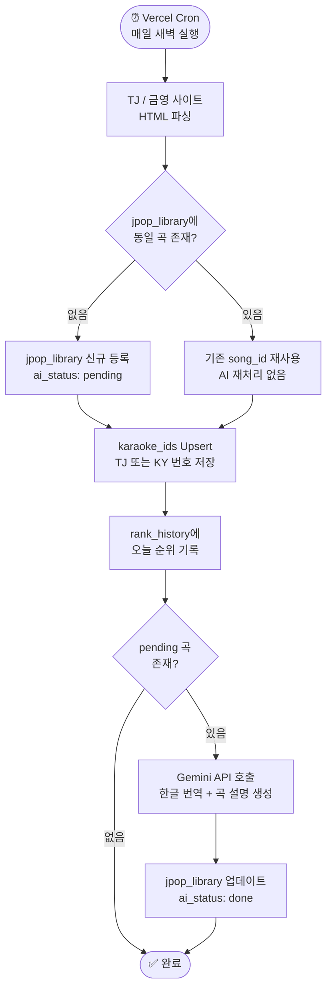
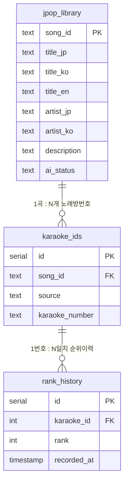

# 🎤 カラチャート! / 가라챠토!

> 국내 노래방(TJ, 금영)의 J-POP Top 100 순위를 기반으로 AI 번역 및 해설을 제공하는 차트 리스트


---

## 📖 Overview / 프로젝트 소개

노래방에서 J-POP은 부르고 싶지만, 차트를 보면 막막하죠.

일본어 제목만 가득한 화면, 아는 노래인지 확인하려고 유튜브 열고 닫고 반복하다 흥이 끊기는 그 순간 
— **가라챠토는 그 번거로움을 없애기 위해 만들었습니다.**

지금 노래방에서 가장 많이 불리는 J-POP을 한글 제목과 곡 정보까지 한 화면에서 바로 확인하세요.

**🎯 이런 분들을 위해 만들었어요**
- J-POP을 노래방에서 즐기고 싶지만 어떤 곡을 골라야 할지 모르는 분
- 일본어를 몰라도 J-POP을 즐기고 싶은 입문자

---

<!-- 📸 스크린샷 / Demo GIF -->
<!-- TODO: 서비스 완성 후 스크린샷 또는 데모 GIF 추가 예정 -->
<!--

-->

---

## ✨ Features / 주요 기능

### 실시간 차트 | Real-time Chart

TJ·금영 노래방의 J-POP TOP 100 순위를 매일 새벽 자동으로 크롤링해 갱신합니다.
상단 스위치로 TJ / 금영 차트를 즉시 전환할 수 있으며, 순위 변동 이력도 DB에 누적 저장됩니다.

### AI 번역 및 곡 해설 | AI Translation & Description

Google Gemini가 일본어 제목·가수명을 자연스러운 한글로 번역하고, 곡의 분위기·장르·특징을 요약 브리핑합니다.
신규 곡에 대해서만 AI를 호출하는 `ai_status` 구조로 비용을 최소화했습니다.

### 유튜브 연동 | YouTube Integration

각 곡의 유튜브 공식 썸네일을 미리보기로 제공합니다.
썸네일을 클릭하면 `[곡명 + 가수명 + karaoke]` 키워드로 유튜브 검색 결과로 바로 이동해, 노래방 버전을 손쉽게 찾을 수 있습니다.

### 통합 검색 | Integrated Search

상단 고정 검색바에서 한국어·일본어·영어(로마자) 어떤 언어로 검색해도 부분 일치로 곡을 찾을 수 있습니다.
Supabase의 `pg_trgm` 익스텐션을 활용해 빠르고 유연한 검색을 지원합니다.

### AI 가이드 챗봇 | AI Guide Chatbot

J-POP 입문자를 위한 섹션별 퀵버튼(예: "분위기 좋은 곡 추천", "따라 부르기 쉬운 곡")과 자유 대화형 챗봇을 제공합니다.
자주 묻는 질문은 DB에 답변을 캐싱해 응답 속도를 높이고 API 비용을 절감합니다.


---

## 🛠 Tech Stack / 기술 스택

| 분류 | 기술 | 버전 | 역할 |
|------|------|------|------|
| **Framework** | Next.js | 15 | App Router 기반 SSR·API Route |
| **Database** | Supabase (PostgreSQL) | - | 곡 정보·순위 이력 저장 및 검색 |
| **AI Engine** | Google Gemini | 1.5 Flash | 번역, 곡 요약, 챗봇 답변 생성 |
| **Deployment** | Vercel | - | 자동 배포 및 Cron Jobs 스케줄러 |
| **Styling** | Tailwind CSS + Framer Motion | - | 다크 모드 UI 및 애니메이션 |

<details>
<summary>📦 상세 기술 선택 이유 보기</summary>
<br>

**Next.js (App Router)**
서버 컴포넌트와 API Route를 함께 활용해 크롤러·AI 처리를 서버 사이드에서 안전하게 실행합니다. Vercel과의 네이티브 통합으로 배포 파이프라인을 단순화했습니다.

**Supabase**
PostgreSQL 기반으로 `pg_trgm` 익스텐션을 통한 한/일/영 부분 일치 검색을 지원합니다. 별도 검색 서버 없이 DB 단에서 빠른 풀텍스트 검색이 가능한 점에서 선택했습니다.

**Google Gemini 1.5 Flash**
속도와 비용 효율이 균형 잡힌 모델로, 일본어 제목·가수명 번역 및 곡 분위기 브리핑에 최적화되어 있습니다. `ai_status` 컬럼으로 신규 곡에 대해서만 호출해 비용을 최소화합니다.

**Vercel Cron Jobs**
매일 새벽 TJ·금영 사이트를 자동 크롤링하는 스케줄러로 활용합니다. 별도 서버 없이 서버리스 환경에서 정기 작업을 실행할 수 있어 인프라를 단순하게 유지합니다.

</details>

---

## 🚀 Getting Started / 시작하기

### 사전 준비 | Prerequisites

- **Node.js** `v18.0.0` 이상
- **pnpm** — 없다면 먼저 설치해주세요

```bash
npm install -g pnpm
```

### 설치 | Installation

```bash
# 1. 레포지토리 클론
git clone https://github.com/your-username/karachato.git
cd karachato

# 2. 패키지 설치
pnpm install
```

### 환경 변수 설정 | Environment Variables

프로젝트 루트에 `.env.local` 파일을 생성하고 아래 값을 채워주세요.

```env
# Supabase
NEXT_PUBLIC_SUPABASE_URL=your_supabase_project_url
NEXT_PUBLIC_SUPABASE_ANON_KEY=your_supabase_anon_key
SUPABASE_SERVICE_ROLE_KEY=your_supabase_service_role_key

# Google Gemini
GEMINI_API_KEY=your_gemini_api_key
```

> **각 키 발급 방법**
> - Supabase: [app.supabase.com](https://app.supabase.com) → 프로젝트 생성 → Settings > API
> - Gemini: [Google AI Studio](https://aistudio.google.com/app/apikey) → Get API Key

### DB 초기화 | Database Setup

> ⚠️ Supabase CLI 환경은 별도로 제공하지 않습니다.
> Supabase 대시보드 → SQL Editor에서 `/supabase/schema.sql`을 직접 실행해주세요.

### 로컬 개발 서버 실행 | Run Locally

```bash
pnpm dev
```

브라우저에서 [http://localhost:3000](http://localhost:3000) 을 열면 됩니다.


---

## 🏗 Architecture / 아키텍처

### 폴더 구조 | Directory Structure

```
karachato/
├── app/                        # Next.js App Router
│   ├── (chart)/                # 차트 탭 페이지
│   ├── (guide)/                # AI 가이드 탭 페이지
│   ├── song/[id]/              # 곡 상세 페이지
│   └── api/
│       ├── cron/               # Vercel Cron 진입점
│       │   └── crawl/          # 크롤러 실행 엔드포인트
│       ├── ai/                 # Gemini AI 처리 라우트
│       └── search/             # 통합 검색 API
├── components/                 # 재사용 UI 컴포넌트
│   ├── chart/                  # 차트 리스트, 순위 카드
│   ├── detail/                 # 곡 상세 모달
│   └── guide/                  # 챗봇, 퀵버튼
├── lib/
│   ├── supabase/               # Supabase 클라이언트 및 쿼리
│   └── gemini/                 # Gemini API 래퍼
├── supabase/
│   └── schema.sql              # DB 초기화 스크립트
└── vercel.json                 # Cron Jobs 설정
```

---

### 데이터 파이프라인 | Data Pipeline

매일 새벽 Vercel Cron이 자동으로 아래 흐름을 실행합니다.



> **비용 절감 포인트**: 동일 곡이 TJ·금영 양쪽에 등재되어 있어도 `jpop_library` 기준으로 AI 호출은 단 1회만 실행됩니다. `ai_status: done` 또는 `failed` 곡은 재처리하지 않습니다.

---

### DB 스키마 | Database Schema




---


## 🐛 Troubleshooting / 트러블슈팅

> 📝 **작성 예정** — 서비스 배포 이후 실제 운영 중 발생한 이슈와 해결책을 종합하여 정리할 예정입니다.
>
> 항목 예시: 크롤러 셀렉터 변경 대응, DB 중복 등록 방지, AI 비용 최적화, Vercel 환경 변수 설정 등

---

## 📄 License

MIT © 2025 가라챠토
