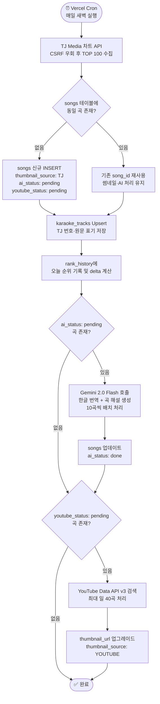
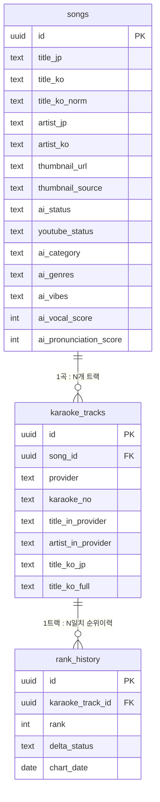

# 🎤 カラチャート! / 가라챠토!

> TJ Media 데이터 기반 J-POP TOP 100 노래방 차트 — AI 번역 및 곡 해설 제공 서비스

[](https://garachato-karaoke-chart.vercel.app/)


---

## 📖 Overview / 프로젝트 소개

노래방에서 J-POP은 부르고 싶지만, 차트를 보면 막막하죠.

일본어 제목만 가득한 화면, 아는 노래인지 확인하려고 유튜브 열고 닫고 반복하다 흥이 끊기는 그 순간
— **가라챠토는 그 번거로움을 없애기 위해 만들었습니다.**

지금 노래방에서 가장 많이 불리는 J-POP을 한글 제목과 곡 정보까지 한 화면에서 바로 확인하세요.

**🎯 이런 분들을 위해 만들었어요**

- J-POP을 노래방에서 즐기고 싶지만 어떤 곡을 골라야 할지 모르는 분
- 일본어를 몰라도 J-POP을 즐기고 싶은 입문자
- 노래방 번호를 빠르게 찾고 싶은 분

---

<p align="center">
  
  
  
  
</p>

---

## ✨ Features / 주요 기능

### 실시간 차트 | Real-time Chart

TJ Media 노래방의 J-POP TOP 100 순위를 매일 새벽 Vercel Cron이 자동으로 크롤링해 갱신합니다.
순위 변동(UP/DOWN/NEW) 이력을 `rank_history` 테이블에 누적 저장하며, 이전 대비 delta도 함께 표시합니다.

### AI 번역 및 곡 해설 | AI Translation & Description

Google Gemini 2.0 Flash가 일본어 제목·가수명을 자연스러운 한글로 번역하고, 장르·분위기·난이도·발음 팁 등을 담은 곡 브리핑을 자동으로 생성합니다.
`ai_status` 컬럼으로 신규 곡에 대해서만 AI를 호출해 비용을 최소화하며, 영어 약어(OST, OP, ED, feat 등)와 팬덤에 정착된 번역은 원문을 우선합니다.

### 유튜브 연동 | YouTube Integration

각 곡의 유튜브 공식 썸네일을 미리보기로 제공합니다.
썸네일을 클릭하면 유튜브에서 노래방 버전을 바로 검색할 수 있도록 연결됩니다.
썸네일 소스는 TJ 기본 → YouTube 업그레이드 방식으로 관리하며, 업그레이드된 썸네일은 재덮어쓰기하지 않습니다.

### 통합 검색 | Integrated Search

고정 상단 검색바에서 한국어·일본어·영어(로마자) 어떤 언어로 검색해도 부분 일치로 곡을 찾을 수 있습니다.
Supabase의 `pg_trgm` 익스텐션과 GIN 인덱스를 활용해 빠르고 유연한 풀텍스트 검색을 지원합니다.

### AI 가이드 챗봇 | AI Guide Chatbot

하단 플로팅 버튼으로 언제든 열 수 있는 모달 기반 챗봇입니다.
Gemini가 사용자의 의도(intent)를 JSON으로 추출하면, 서버사이드에서 Supabase 쿼리로 곡 추천·번호 검색·장르 필터링 등을 수행합니다.
이스터에그 전처리 로직도 내장되어 있습니다.

---

## 🛠 Tech Stack / 기술 스택

| 분류 | 기술 | 역할 |
|------|------|------|
| **Framework** | Next.js 15 (App Router) | SSR·API Route·Cron 진입점 |
| **Language** | TypeScript | 전체 타입 안전성 |
| **Database** | Supabase (PostgreSQL) | 곡 정보·순위 이력 저장, pg_trgm 검색 |
| **AI Engine** | Google Gemini 2.0 Flash | 번역, 곡 해설, 챗봇 intent 추출 |
| **외부 API** | YouTube Data API v3 | 썸네일 수집 (일 40곡 상한) |
| **Styling** | Tailwind CSS v4 + Framer Motion | 다크 모드 UI 및 애니메이션 |
| **상태 관리** | Zustand | 차트 설정, 챗봇 열림 여부 |
| **Deployment** | Vercel (Hobby) | 자동 배포 및 Cron Jobs |
| **Package Manager** | pnpm | - |
| **개발 도구** | Storybook | 컴포넌트 단위 개발 및 문서화 |

<details>
<summary>📦 주요 기술 선택 이유</summary>
<br>

**Next.js 15 App Router**
서버 컴포넌트와 API Route를 함께 활용해 크롤러·AI 처리를 서버 사이드에서 안전하게 실행합니다. `params`와 `searchParams`가 Promise로 처리되는 v15 규칙을 준수합니다.

**Supabase**
PostgreSQL 기반으로 `pg_trgm` 익스텐션을 통한 한/일/영 부분 일치 검색을 지원합니다. 별도 검색 서버 없이 DB 단에서 빠른 풀텍스트 검색이 가능합니다. Supabase join은 outbound FK(자식→부모)는 단일 객체, inbound FK(부모→자식)는 배열로 반환되는 방향 규칙을 엄격하게 관리합니다.

**Google Gemini 2.0 Flash**
속도와 비용 효율이 균형 잡힌 모델로, 일본어 번역과 곡 분위기 브리핑에 최적화되어 있습니다. `responseMimeType: "application/json"` 설정으로 구조화된 응답을 안정적으로 수신합니다. 무료 티어 1,500 req/day 한도에 맞춰 신규 곡에만 호출합니다.

**Vercel Cron Jobs**
매일 새벽 TJ 사이트를 자동 크롤링하는 스케줄러로 활용합니다. 크롤링(`/api/cron`) → AI 처리(`/api/cron-ai`) → YouTube 썸네일(`/api/cron-youtube`) 순으로 3개의 엔드포인트를 분리해 독립 실행이 가능합니다.

</details>

---

## 🚀 Getting Started / 시작하기

### 사전 준비 | Prerequisites

- **Node.js** `v18.0.0` 이상
- **pnpm** — 없다면 먼저 설치해주세요

```bash
npm install -g pnpm
```

### 설치 | Installation

```bash
# 1. 레포지토리 클론
git clone https://github.com/your-username/karachato.git
cd karachato

# 2. 패키지 설치
pnpm install
```

### 환경 변수 설정 | Environment Variables

프로젝트 루트에 `.env.local` 파일을 생성하고 아래 값을 채워주세요.

```env
# Supabase
NEXT_PUBLIC_SUPABASE_URL=your_supabase_project_url
NEXT_PUBLIC_SUPABASE_ANON_KEY=your_supabase_anon_key
SUPABASE_SERVICE_ROLE_KEY=your_supabase_service_role_key

# Google Gemini
GEMINI_API_KEY=your_gemini_api_key

# YouTube Data API
YOUTUBE_API_KEY=your_youtube_api_key

# Cron 인증 (프로덕션 필수)
CRON_SECRET=your_cron_secret  # openssl rand -base64 32
```

> **각 키 발급 방법**
> - Supabase: [app.supabase.com](https://app.supabase.com) → 프로젝트 생성 → Settings > API
> - Gemini: [Google AI Studio](https://aistudio.google.com/app/apikey) → Get API Key
> - YouTube: [Google Cloud Console](https://console.cloud.google.com) → YouTube Data API v3 사용 설정

### DB 초기화 | Database Setup

> ⚠️ Supabase CLI 환경은 별도로 제공하지 않습니다.
> Supabase 대시보드 → SQL Editor에서 `/supabase/schema.sql`을 직접 실행해주세요.
> `pg_trgm` 익스텐션 및 GIN 인덱스 생성 구문이 포함되어 있습니다.

### 로컬 개발 서버 실행 | Run Locally

```bash
pnpm dev
```

브라우저에서 [http://localhost:3000](http://localhost:3000) 을 열면 됩니다.

### Cron 로컬 테스트 | Local Cron Test

아래 순서대로 순차 호출합니다.

```bash
# 1단계: TJ 크롤링
curl http://localhost:3000/api/cron

# 2단계: AI 번역·가수명 처리
curl http://localhost:3000/api/cron-ai

# 3단계: YouTube 썸네일 수집
curl http://localhost:3000/api/cron-youtube
```

---

## 🏗 Architecture / 아키텍처

### 폴더 구조 | Directory Structure

```
karachato/
├── public/
│   ├── fonts/
│   └── og-image.png
└── src/
    ├── app/                        # Next.js App Router
    │   ├── api/
    │   │   ├── cron/               # STEP 1: TJ 크롤러
    │   │   ├── cron-ai/            # STEP 2: Gemini AI 번역 배치
    │   │   ├── cron-youtube/       # STEP 3: YouTube 썸네일 수집
    │   │   ├── chat/               # 챗봇 API (intent 추출 + Supabase 쿼리)
    │   │   └── search/             # 통합 검색 API
    │   ├── search/                 # 검색 결과 페이지
    │   ├── song/[id]/              # 곡 상세 페이지 (동적 라우트)
    │   ├── layout.tsx
    │   ├── loading.tsx             # 홈 스켈레톤
    │   ├── page.tsx                # 메인 차트 페이지
    │   ├── robots.ts
    │   └── sitemap.ts
    ├── components/
    │   ├── chart/                  # 차트 리스트, 순위 카드
    │   ├── common/                 # 공용 UI (버튼, 아이콘 등)
    │   ├── modals/                 # SettingModal, ChatModal
    │   ├── search/                 # 검색바, 검색 결과
    │   ├── skeletons/              # 로딩 스켈레톤
    │   └── song-detail/            # 곡 상세 정보
    ├── lib/
    │   ├── ai/                     # AI 처리 배치 로직
    │   ├── chart/                  # 차트 데이터 fetching
    │   ├── crawlers/               # TJ 크롤러
    │   ├── gemini/                 # Gemini API 래퍼 (번역, intent 추출)
    │   ├── mappers/                # DB 응답 → UI 타입 변환
    │   ├── mock/                   # 개발용 목 데이터
    │   ├── song/                   # 곡 상세 fetching
    │   ├── supabase/               # Supabase 클라이언트
    │   └── youtube/                # YouTube API 래퍼
    ├── store/                      # Zustand 스토어
    ├── styles/
    ├── types/                      # TypeScript 타입 정의
    └── utils/                      # 공용 유틸 함수
```

---

### 데이터 파이프라인 | Data Pipeline

매일 새벽 Vercel Cron이 아래 흐름을 자동으로 실행합니다.



> **비용 절감 포인트**: `ai_status: done` 또는 `failed` 곡은 재처리하지 않습니다. 동일 곡이 날짜만 달리 반복 등장해도 AI 호출은 최초 1회만 실행됩니다.

---

### DB 스키마 | Database Schema



> **Supabase join 방향 규칙**: outbound FK(자식→부모)는 단일 객체를 반환하고, inbound FK(부모→자식)는 배열을 반환합니다. `rank_history → karaoke_tracks → songs` 방향으로 join 시 이 규칙을 엄수합니다.

---

### 챗봇 아키텍처 | Chatbot Architecture

```
사용자 입력
    ↓
app/api/chat/route.ts
    ├── 이스터에그 키워드 전처리 (checkEasterEgg)
    └── Gemini: intent JSON 추출
        {
          type: "search_song" | "search_artist" | "recommend" | "get_number" | ...,
          keyword: string,
          category: string
        }
            ↓
        Supabase 쿼리 (서버사이드)
            ↓
        JSON 응답 → ChatModal 렌더링
```

---

## 🔍 Search / 검색 구현

`pg_trgm` 익스텐션과 GIN 인덱스를 활용합니다. 검색 대상 컬럼은 정규화된 `norm` 컬럼을 사용해 특수문자·괄호 내용을 제거한 후 비교합니다.

정규화 규칙 (`utils/string.ts > normalize()`)은 다음과 같습니다.

1. 반각 괄호 `(…)` 안 내용 제거
2. 전각 괄호 `（…）` 안 내용 제거
3. 한글·일본어·영문·숫자·공백 외 특수문자 제거
4. 연속 공백 → 단일 공백 통일
5. 소문자 변환

---

## 🐛 Troubleshooting / 트러블슈팅

### TJ 크롤러 — CSRF 토큰 처리

TJ Media API는 `x-csrf-token` 헤더와 `JSESSIONID` 쿠키를 함께 요구합니다. 차트 페이지를 먼저 GET 요청해 토큰과 세션을 추출한 뒤 차트 API를 POST 호출합니다. `set-cookie`를 `,`로 파싱하면 날짜 형식 내 쉼표까지 분리되므로, 정규식으로 각 값을 직접 추출합니다.

### KY(금영) 크롤러 — TLS 핑거프린트 차단

`kygabang.com`은 TLS 핑거프린트 수준에서 Node.js 환경을 차단합니다. User-Agent, Sec-Fetch 헤더 등 다양한 우회 시도에도 불구하고 만료 도메인으로 리다이렉트하는 방식으로 차단되며, PowerShell(WinHTTP)에서는 정상 응답을 확인했습니다. Vercel 환경에서 Puppeteer 도입은 비용·복잡도 문제로 현재 보류 상태이며, KY 탭은 toast 알림으로 안내합니다.

### YouTube API 쿼터 관리

`search.list`는 호출당 100 units를 소비하며 일일 한도는 10,000 units입니다. 이에 따라 일 40곡 처리 상한을 적용하고, `quotaExceeded` 에러 발생 시 해당 루프를 즉시 중단해 다음날 자동 재시도합니다.

### Supabase 서브쿼리 미지원

Supabase JS 클라이언트는 복잡한 서브쿼리 필터를 지원하지 않습니다. 2-step 쿼리 패턴(ID 목록 먼저 조회 → `.in()`으로 필터링)으로 해결합니다.

### Next.js 15 params / searchParams

Next.js 15부터 `params`와 `searchParams`는 Promise로 처리됩니다. 동적 라우트 및 검색 페이지에서 반드시 `await`가 필요합니다.

---

## 📄 License

MIT © 2026 가라챠토
